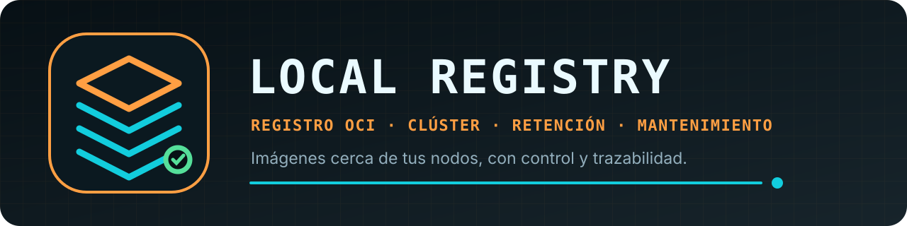

<p align="center">
  
</p>

<p align="center">
  <a href="https://github.com/Ezr43l/local-registry-s/actions/workflows/ci.yml"></a>
  
  
  
  <a href="LICENSE"></a>
</p>

<p align="center"><strong>Tu registro OCI, cerca de los nodos y bajo tu control.</strong></p>

Local Registry es un registro Docker/OCI autohospedado con panel web integrado,
comparación entre nodos y mantenimiento coordinado. La única versión publicada
en este repositorio es `v1.2.15`.

Se distribuye como una única imagen para contenedores Linux. La variante
`linux/amd64` sirve para los servidores Unraid/x86-64 habituales y
`linux/arm64` para hosts ARM; Docker elige automáticamente la correcta. No es
una aplicación nativa para Windows.

**[Configuración](docs/CONFIGURATION.md)** ·
**[Seguridad](SECURITY.md)** ·
**[Distribución integrada](docs/DISTRIBUTION-PATCH.md)** ·
**[Checklist de release](docs/RELEASE-CHECKLIST.md)**

## Instalación

### Unraid

La plantilla `unraid/my-Local-Registry.xml` sólo pide tres datos:

1. puerto del Registry, normalmente `5000`;
2. puerto del panel, normalmente `5001`;
3. directorio persistente, normalmente `/mnt/user/appdata/local-registry`.

La plantilla descarga `ghcr.io/ezr43l/local-registry-s:stable`; no depende de un
Registry que ya exista en la red local. Al terminar de crear el contenedor, abre
la WebUI. El asistente solicita el nombre del nodo, la topología, la retención,
el horario y la zona horaria. Esos datos quedan dentro del volumen persistente,
nunca en la plantilla.

La primera cuenta propietaria se crea en un solo nodo. Los demás nodos del
mismo clúster la adoptan al abrir su WebUI mediante la autenticación interna
entre paneles; no vuelven a mostrar el formulario de registro.

Después del primer inicio, todos los parámetros funcionales siguen disponibles
en **Configuración**. El inventario completo de campos trasladados, retirados y
reservados a Docker está en [`docs/CONFIGURATION.md`](docs/CONFIGURATION.md).

### Docker Compose

```bash
cp .env.example .env
docker compose up -d --build
```

Después abre `http://localhost:5001`. El Registry queda en
`http://localhost:5000` y sus datos en `REGISTRY_DATA_DIR`, cuyo valor inicial
es `./data/registry`.

Compose construye la imagen desde el código, por lo que también permite el
primer arranque cuando aún no existe ningún Registry.

## Primer arranque

La primera visita pide crear la cuenta propietaria del panel. Después de
iniciar sesión, el formulario de configuración pide:

- el nombre de este nodo y su zona horaria;
- una línea por miembro con el formato
  `nombre | URL del Registry | URL del panel`;
- conservación, etiquetas protegidas, horario, GC, coordinador y origen de
  sincronización;
- un código de incorporación sólo si el nodo se une a un clúster existente.

En una instalación aislada se introduce una sola línea. La URL del panel puede
quedar vacía para el nodo local, por ejemplo:

```text
node-a | http://servidor-a:5000 |
```

El primer nodo genera el token de clúster que firma las órdenes internas entre
paneles y lo guarda con modo `0600` en
`/var/lib/registry/.local-registry/secrets`. Si habrá más nodos, copia el código
de incorporación y pégalo en su asistente inicial; así todos reciben el mismo
secreto interno sin añadirlo a Docker, Compose o Unraid.

El formulario es de una sola escritura. Después de guardarlo, el panel se
reinicia dentro del mismo contenedor y carga la configuración persistente.

## Un contenedor y un volumen

Local Registry ejecuta Distribution y su panel supervisado dentro del mismo
contenedor. No requiere contenedores auxiliares, bases de datos ni servicios de
control. El volumen `/var/lib/registry` contiene:

- imágenes y blobs OCI;
- configuración del panel;
- credenciales generadas;
- estado e historial de mantenimiento.

Respaldar y restaurar ese volumen conserva la instalación completa. No publiques
los puertos directamente en Internet: la API OCI está pensada para una red local
de confianza. Si debe exponerse, añade TLS y autenticación/autorización delante
del Registry.

## Funcionamiento del mantenimiento

`KEEP_LAST=0`, el valor inicial del asistente, desactiva el borrado por
retención. Las acciones reales exigen una sesión iniciada y confirmación.
La limpieza cuenta manifiestos únicos, conserva etiquetas protegidas y no borra
imágenes cuya fecha no puede determinar.

En clúster, todos los paneles comparten una topología y un token. El coordinador
reserva la operación en cada nodo antes de borrar. La ventana ejecuta:

1. comprobación y reserva de todos los nodos;
2. retención global de etiquetas antiguas;
3. garbage collection secuencial, deteniendo un Registry cada vez;
4. sincronización y comprobación final de deriva.

Si un nodo requerido no responde, la política segura impide el borrado.

## API principal

```text
GET  /api/health
GET  /api/auth
POST /api/auth/setup
POST /api/auth/session
DELETE /api/auth/session
GET  /api/setup
POST /api/setup
GET  /api/all
GET  /api/summary
GET  /api/projects
GET  /api/drift
GET  /api/maintenance
GET  /api/maintenance/retention
POST /api/maintenance/gc?confirm=1
POST /api/maintenance/retention?confirm=1
POST /api/maintenance/sync?confirm=1
POST /api/maintenance/window?confirm=1
POST /api/maintenance/coordinator
```

Las operaciones de mantenimiento requieren la cookie de sesión, verificación
CSRF y `X-Registry-Maintenance: 1`. No existe un token de desbloqueo humano.

## Compatibilidad con instalaciones anteriores

El backend continúa aceptando las variables históricas y los secretos mediante
`*_FILE` para no romper despliegues existentes. Tienen prioridad cuando se
proporcionan explícitamente. Los artefactos públicos nuevos no las incluyen:
el asistente de la app es la vía normal de configuración.

`deploy-registry.sh` se conserva como herramienta de migración y despliegue
privado heredado. Sigue aceptando ficheros de secretos y topología externa; no
representa el flujo de instalación pública de tres campos.

## Construcción y comprobaciones

```bash
./build-local-registry.sh
python -m unittest discover -s tests
cd docker/local-registry/web
npm ci
npm run build
```

La construcción usa bases fijadas por digest, ejecuta TypeScript y las pruebas
Python antes de producir la imagen. Distribution `3.1.1` se compila desde su
commit fijado con las actualizaciones y el parche descritos en
`docs/DISTRIBUTION-PATCH.md`.

La imagen pública se construye automáticamente después de superar todas las
comprobaciones. Cada versión queda disponible con su etiqueta exacta y el alias
`stable` se actualiza sólo tras verificar la publicación.

## Licencia

El código y la documentación se distribuyen bajo Apache License 2.0. Las
licencias y avisos de componentes incorporados se detallan en
`THIRD_PARTY_NOTICES.md`.
